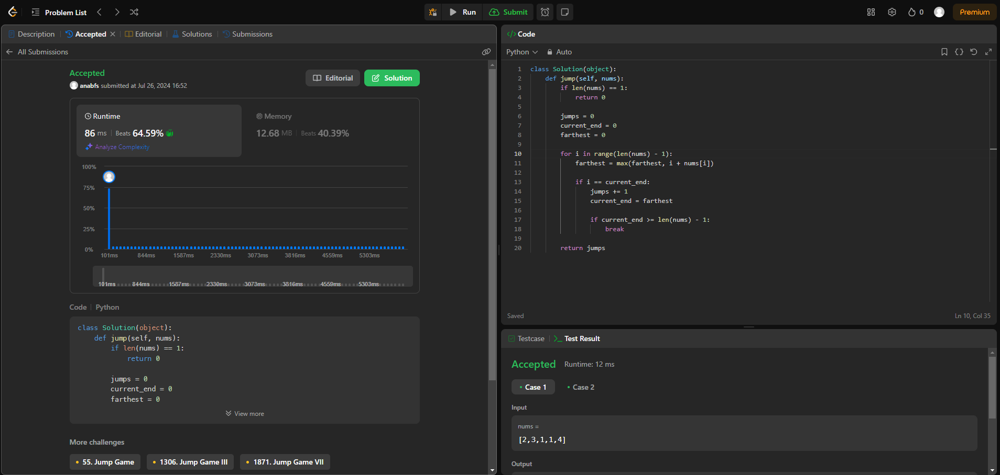
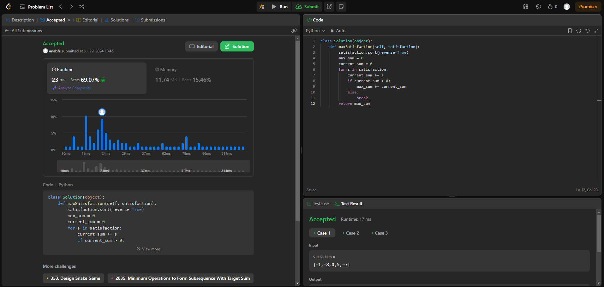
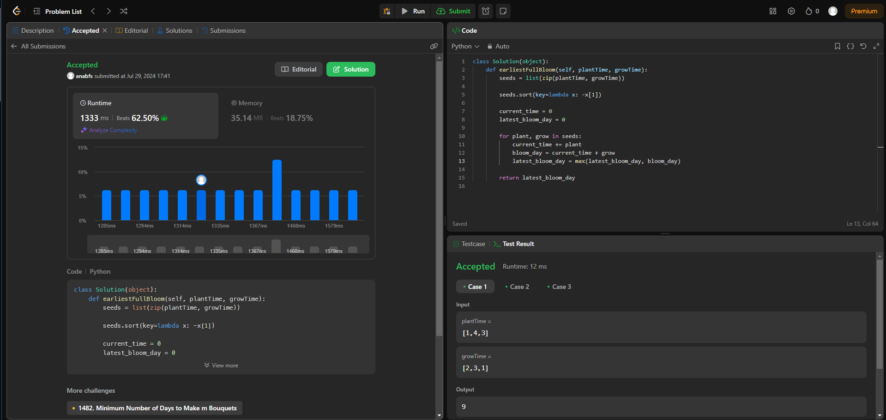

# Algoritmos Ambiciosos - Online Judge

**Número da Lista**: 21 
**Conteúdo da Disciplina**: Algoritmos Ambiciosos 

## Alunos

|Matrícula | Aluno |
| -- | -- |
| 18/0097181  |  Ana Beatriz Santos |
| 20/0023748  |  Marcos Santos Bittar |

## Sobre

Repositório com resoluções de problemas de algoritmo ambicioso do [LeetCode](https://leetcode.com/).

## Apresentação

## Screenshots

### Exercício 1 - Jump Game II

Dificuldade: Médio  
Link: [Jump Game II](https://leetcode.com/problems/jump-game-ii/description/) 
Solução: [Código](assets/codes/jumpii.py) 
O problema requer encontrar o número mínimo de saltos para alcançar o último índice de um array, dado que cada elemento do array indica o máximo de posições que você pode saltar para frente a partir desse índice. Para resolver este problema, usamos algoritmos ambiciosos.

### Exercício 2 - Reducing Dishes

Dificuldade: Difícil  
Link: [Reducing Dishes](https://leetcode.com/problems/reducing-dishes/description/) 
Solução: [Código](assets/codes/reducing.py) 
Para resolver este problema com um algoritmo ambicioso, a ideia é que, para maximizar o somatório dos coeficientes de tempo de satisfação, devemos ordenar as satisfações em ordem decrescente e somar os pratos de forma que o impacto das satisfações maiores seja multiplicado por tempos maiores.

### Exercício 3 - Earliest Possible Day of Full Bloom

Dificuldade: Difícil  
Link: [Earliest Possible Day of Full Bloom](https://leetcode.com/problems/earliest-possible-day-of-full-bloom/description/) 
Solução: [Código](assets/codes/earliest.py) 
ara resolver este problema, onde temos que determinar o dia mais cedo em que todas as sementes estarão florescendo, precisamos considerar a ordem em que plantamos as sementes.

## Instalação

**Linguagem**: Python 
Você precisará apenas criar uma conta no [LeetCode](https://leetcode.com/).

## Uso

Para executar o trabalho basta abrir o link do exercício e copiar e colar o código.
